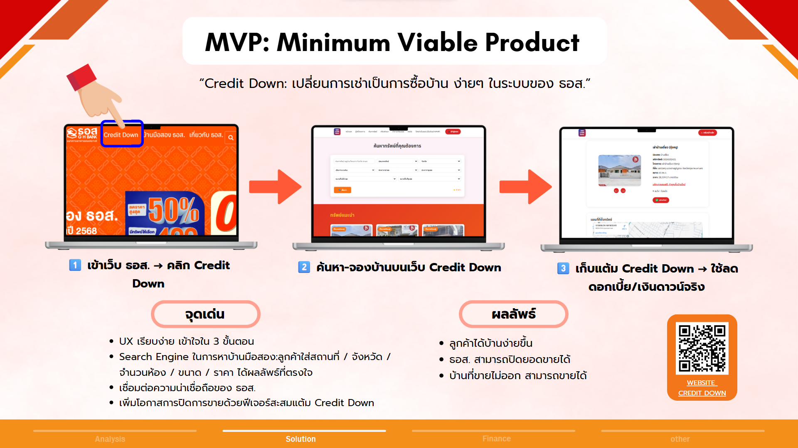

เว็บไซต์นี้จัดทำขึ้นเพื่อการนำเสนอแนวคิด MVP (Minimum Viable Product) ของโครงการ “Credit Down” เท่านั้น
ไม่มีเจตนาในการละเมิดลิขสิทธิ์ หรือแอบอ้างสิทธิ์ทางการค้าใด ๆ ของธนาคารอาคารสงเคราะห์ (GHB)

#### ข้อมูลทั้งหมดถูกสร้างขึ้นเพื่อใช้ในการทดสอบไอเดียและแนวทางการออกแบบแพลตฟอร์มสำหรับผู้สนใจเท่านั้น [ไม่ใช่ระบบจริงของธนาคาร]
ข้อมูลทั้งหมดถูกสร้างขึ้นเพื่อใช้ในการทดสอบไอเดียและแนวทางการออกแบบแพลตฟอร์มสำหรับผู้สนใจเท่านั้น  
[ไม่ใช่ระบบจริงของธนาคาร]

@@ -16,29 +17,29 @@
1. เปิดเว็บไซต์:
👉 https://ghb-credit-down-mvp.vercel.app
2. กดที่คำว่า CreditDown บนแท็บด้านบน
3. หน้าแรกจะปรากฏ แถบค้นหา (Search Bar) 
#### กรอกข้อมูลตามที่ต้องการ:
3. หน้าแรกจะปรากฏ แถบค้นหา (Search Bar)  
กรอกข้อมูลตามที่ต้องการ:
- จังหวัด
- ทำเล
- จำนวนห้อง
- ขนาดพื้นที่
- งบประมาณ
4. ระบบจะแสดงรายการบ้านที่ตรงกับความต้องการ
5. กดเลือกดูรายละเอียดบ้านที่สนใจ
6. หากสนใจเช่า → กด “จอง” หรือ “ติดต่อโครงการ” เพื่อดำเนินการต่อ
7. แต้ม Credit Down จากการเช่าจะสะสมอัตโนมัติในระบบ (ฟีเจอร์นี้จะเพิ่มมาในเร็วๆนี้)

### 📱 สำหรับผู้ใช้งานผ่าน สมาร์ทโฟน (Mobile View)
1. เปิดเว็บผ่านเบราว์เซอร์มือถือ เช่น Chrome หรือ Safari
2. มองหาสัญลักษณ์ ปุ่มสามขีด (☰ Menu) ด้านบนขวา
3. กดเมนู แล้วเลือก “Credit Down”
4. ระบบจะพาเข้าสู่หน้า Credit Down Home
5. ใช้แถบค้นหาบ้านเหมือนกับเวอร์ชันเดสก์ท็อป
6. เลือกบ้าน → ดูรายละเอียด → เริ่มการเช่า
7. แต้มสะสมจากค่าเช่าจะถูกเก็บไว้ในบัญชีผู้ใช้ (ฟีเจอร์นี้จะเพิ่มมาในเร็วๆนี้)

#### 💡 หมายเหตุ:
แต้มสะสม Credit Down สามารถนำไปใช้ลดดอกเบี้ยหรือเงินดาวน์ หากซื้อบ้านหลังที่เช่า

ใช้งานได้ทั้งบนมือถือและคอม โดยไม่ต้องโหลดแอป
